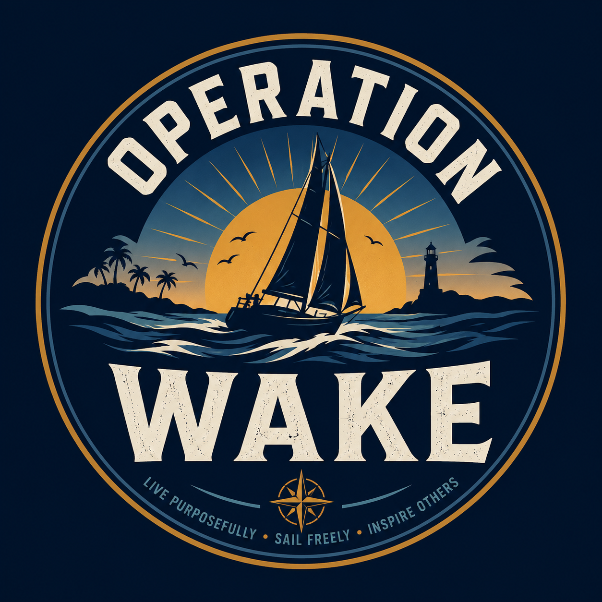

<!DOCTYPE html>
<html lang="en">
<head>
  <meta charset="UTF-8" />
  <meta name="viewport" content="width=device-width, initial-scale=1.0" />
  <meta name="description" content="Operation Wake is a family mission built around faith, freedom, education, exploration, and the journey toward life on the water." />
  <title>Operation Wake | Leave More Than a Wake</title>
  <link rel="preconnect" href="https://fonts.googleapis.com">
  <link rel="preconnect" href="https://fonts.gstatic.com" crossorigin>
  <link href="https://fonts.googleapis.com/css2?family=Barlow+Condensed:wght@500;600;700;800&family=Inter:wght@400;500;600;700&display=swap" rel="stylesheet">
  <link rel="stylesheet" href="style.css" />
</head>
<body>
  <header class="site-header">
    <a class="brand" href="#top" aria-label="Operation Wake home">
      
      OPERATION WAKE
    </a>

    <button class="menu-toggle" aria-label="Open navigation" aria-expanded="false">☰</button>

    <nav class="nav-links" aria-label="Primary navigation">
      <a href="#mission">Mission</a>
      <a href="#journey">Journey</a>
      <a href="#watch">Watch</a>
      <a href="#support">Support</a>
    </nav>
  </header>

  <main id="top">
    <section class="hero">
      

      

      

        
A FAMILY MISSION IN MOTION

        
        <h1>LEAVE MORE THAN A WAKE.</h1>
        

          We are building a future shaped by faith, family, freedom, education, and life on the water.
          This is the story of how we get there.
        

        

          <a class="button button-primary" href="#journey">Enter the Journey</a>
          <a class="button button-secondary" href="#watch">Watch the Story</a>
        

      

      <a class="scroll-cue" href="#mission" aria-label="Scroll to mission">
        SCROLL
        
      </a>
    </section>

    <section id="mission" class="section section-light">
      

        
WHY WE STARTED

        <h2>The journey begins before the boat.</h2>
      

      

        

          

            Operation Wake follows one family as we simplify our lives, strengthen our finances,
            learn the skills of seamanship, and work toward a future of exploration and education afloat.
          

          

            We are not waiting for life to happen to us. We are building it deliberately, one decision,
            one sacrifice, and one mile at a time.
          

        

        <aside class="mission-card">
          01
          <h3>Our North Star</h3>
          

            Create a life where our children learn from the world itself, where family time is protected,
            and where adventure becomes part of the curriculum.
          

        </aside>
      

    </section>

    <section id="journey" class="section section-dark">
      

        
MISSION STATUS

        <h2>Every voyage has a departure date.</h2>
      

      

        

          TARGET DEPARTURE
          <h3>January 1, 2032</h3>
          

            The countdown is not pressure. It is a compass. Every day between now and then is part of the story.
          

        

        

          
<strong id="days">0</strong>Days

          
<strong id="hours">0</strong>Hours

          
<strong id="minutes">0</strong>Minutes

          
<strong id="seconds">0</strong>Seconds

        

      

      

        <article>
          01
          <h3>Prepare</h3>
          
Reduce debt, grow income, build the platform, and protect the family plan.

        </article>
        <article>
          02
          <h3>Learn</h3>
          
Gain sailing experience, complete training, inspect boats, and sharpen seamanship.

        </article>
        <article>
          03
          <h3>Launch</h3>
          
Acquire the right boat, begin coastal cruising, and let the classroom widen to the horizon.

        </article>
      

    </section>

    <section id="watch" class="section section-light">
      

        

          
FOLLOW THE BUILD

          <h2>The story is already underway.</h2>
        

        <a class="text-link" href="#" aria-label="YouTube link placeholder">YouTube channel coming soon ↗</a>
      

      

        
▶

        

          
LATEST EPISODE

          <h3>Welcome to Operation Wake</h3>
          
Our first episode will live here once the channel launches.

        

      

    </section>

    <section id="support" class="section support-section">
      

        
JOIN THE CREW

        <h2>Help us turn the horizon into a home.</h2>
        

          Follow the mission, share the story, wear the mark, or connect with us through real estate.
          Every contribution to the journey moves the wake a little farther.
        

        

          <a class="button button-primary" href="mailto:hello@operationwake.com">Contact Operation Wake</a>
          <a class="button button-secondary" href="#">Merch store coming soon</a>
        

      

    </section>
  </main>

  <footer>
    

      
      

        <strong>OPERATION WAKE</strong>
        Leave More Than a Wake.
      

    

    
©  Operation Wake. All rights reserved.

  </footer>

  
</body>
</html>
